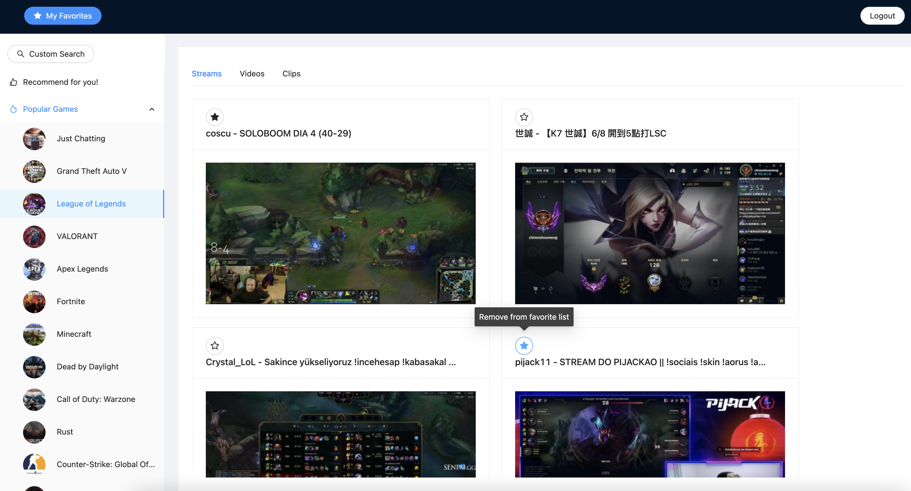

# twitch-engene
Web app that allows users to search and get recommendation for twitch resources (stream/video/clip). Users can login to favorite records.



## Tech stack
- Frontend: Javascript React, Ant Design
- Backend: Java Spring, Hibernate
- REST API: Twitch(get-top-games, get-games)
- Cloud: AWS EC2, RDS(MySQL Engene)

## Feature
1. Browse all popular games and view the resources of each game
2. Recommend resources based on search history
3. Favorite/remove records and save into user list
4. Session-based authentication

## Requirements
The following instruction applies to Linux/MacOS development environment.

### ItelliJ Ultimate IDE
- Download and install the latest IntelliJ IDEA Ultimate from [here](http://jetbrains.com/idea/download). 
- Choose the Ultimate version (>=2020.02).
- Refer to [Installation Guide](https://www.jetbrains.com/help/idea/run-for-the-first-time.html)to perform the initial setup

### Apache Tomcat
- Open [this page](http://tomcat.apache.org/download-90.cgi), and select the binary based on your US under the `Core` section
	- Mac: tar.gz
	- Windows: 64-bit Windows zip
- For macOS user only: make the `catalina.sh` script in the bin folder executable.  `cd` to your apache-tomcat directory, then run the following command
```shell
>$ chmod 755 bin/catalina.sh
```
### Java
- Download Java 8 or higher from [here](https://www.oracle.com/java/technologies/downloads/#java8)

## Backend Configuration
### Apache Tomcat
Open the `first` folder In the ItelliJ IDE, and add Apache Tomcat as a Run/Debug configuration, so that the IDE knows how to run the program.  
- On top right of the IDE, click `Add Configuration...`
- In the new window, select `Add new` - `Tomcat Server` - `Local`
- In the new dialog, under the `Server` tab, click the `Configure...` button on the right of `Application server`
- Specify the _Tomcat Home_. Locate where the Tomcat directory you saved on your disk
- There will be a warning at the bottom.  Click `Fix`, and in the new window select the `Problem` tab, and define the project SDK
- Close the Configuration window
- There will be a small window on the bottom right of the IDE that says `Maven built project found`.  Select `first`
- Open the configuration window again, and click `Fix` in warning, and choose `first: war exploded`
- Under the deployment tab, change the application context to `/`
- Click `OK` to apply and save all changes

### Database
This project is using RDS MySQL engene from AWS.  You would need to connect to your own database.


## Start the Backend Server
- On the tab of the right side of the IDE, find the `Maven` tab
- Select `first` - `Lifecycle` - `clean` to clear all previous builds
- Select `first` - `Lifecycle` - `install` to start a new build
- Now we have a Run_/Debug Configuration_ setup. You can build and run by clicking the green ▶️ button
- Open your browser and use the following address to make sure your Tomcat server is running correctly: [http://localhost:8080/]

# Start the Frontend Server
Go to `frontend` folder and install modules from package.json
```shell
>$ npm install 
```

Start the fronend server
```shell
>$ npm start
```

## Build
Now the project should be running successfully on your local machine.  The following steps are to deploy it to EC2

### Build the frontend
In the frontend folder, run the following command
```shell
>$ npm run build
```

A `build` folder will be generated under the `frontend` folder, now move all the files inside of the `build` folder directly to `first/src/main/webapp`.

Remove the `index.jsp` file in the `webapp` folder, and update the file `first-servlet.xml` in the same folder to following
```xml
<?xml version="1.0" encoding="UTF-8" ?>
 
<beans xmlns="http://www.springframework.org/schema/beans"
      xmlns:xsi="http://www.w3.org/2001/XMLSchema-instance"
      xmlns:context="http://www.springframework.org/schema/context"
      xmlns:mvc="http://www.springframework.org/schema/mvc"
      xsi:schemaLocation="http://www.springframework.org/schema/beans
     http://www.springframework.org/schema/beans/spring-beans.xsd
     http://www.springframework.org/schema/context
     http://www.springframework.org/schema/context/spring-context.xsd http://www.springframework.org/schema/mvc https://www.springframework.org/schema/mvc/spring-mvc.xsd">
 
   <mvc:resources mapping="/**" location="/" />
   <context:component-scan base-package="com.project.first" />
</beans>
```

### Build the backend
Open the `first` folder in IntelliJ
- On the tab of the right side of the IDE, find the `Maven` tab
- Select `first` - `Lifecycle` - `clean` to clear all previous builds
- Select `first` - `Lifecycle` - `install` to start a new build

A `target` folder will be generated.  Underneath it find a file called `first-1.0-snapshot.war` and rename it to `first.war`

## Deployment
We are deploying this project to AWS EC2.  See [EC2 documentation](https://docs.aws.amazon.com/ec2/index.html) for information on how to set up and launch an instance


### Connect to EC2
After an EC2 instance is set up and launched, you should have the `public IP address` of your instance downloaded a `key pair` file (.pem) downloaded from AWS. `cd` into where you store your key pair file, and run the following command in your terminal/git bash to ssh into your instance
```shell
>$ chmod 600 <YOUR_PRIVATE_KEY_NAME>
>$ ssh -i <YOUR_PRIVATE_KEY_NAME> ubuntu@<YOUR_INSTANCE_IP>
```


### Set up Docker
We will use docker to handle Linux containers on EC2.  

To install the docker, run the following comman 
```shell
>$ sudo apt-get install \
   apt-transport-https \
   ca-certificates \
   curl \
   gnupg-agent \
   software-properties-common
   
>$ sudo add-apt-repository \
   "deb [arch=amd64] https://download.docker.com/linux/ubuntu \
   $(lsb_release -cs) \
   stable"
   
>$ sudo apt-get update
>$ sudo apt-get install docker-ce docker-ce-cli containerd.io
```

Run the following command to verify if Docker is installed correctly
```shell
>$ sudo docker run hello-world
```


### Upload the build 
Open a new terminal/git bash window, `cd` into where your pair key is stored and execute the following command.  
```shell
>$ scp -i <YOUR_PRIVATE_KEY_NAME>  <FIRST_WAR_LOCATION>/first.war ubuntu@<YOUR_INSTANCE_IP>:~/
```


### Build a Docker Image
Go back to the terminal/git bash window that is SSH’ed to your EC2 instance, create a new file called Dockerfile
```shell
>$ vim Dockerfile
```
Paste the following content in the `Dockerfile`.  Modify the tomcat version if needed
```shell
FROM tomcat:9.0.58-jdk17-openjdk                                  
MAINTAINER <YOUR_EMAIL_ADDRESS>                                                                                                                      
COPY ./first.war /usr/local/tomcat/webapps/ROOT.war      
EXPOSE 8080                                                            
CMD ["catalina.sh", "run"]
```
Save and quit the vim editor.  Now use `ls` to list all the files in the current directory, and make sure both `Dockerfile` and `first.war` are listed.

Run the command below to build an image called `first`.
```shell
>$ sudo docker build -t first .
```

To run your image locally
```shell
>$ sudo docker run -d -p 80:8080 first
```

Now the project should be deployed successfully to your EC2 instance!  use `http://<YOUR_INSTANCE_IP>` to test your service


### Some useful commands to manipulate Docker
Check existing images
```shell
>$ sudo docker images
```
Check running containers (you can also find container id here)
```shell
>$ sudo docker ps
```
Check the log of a container
```shell
>$ sudo docker logs <container_id>
```
Stop a Docker container
```shell
>$ sudo docker stop <container_id>
```
Remove an existing container or image
```shell
>$ sudo docker rm <container_id>
>$ sudo docker rmi <image_name>
```
